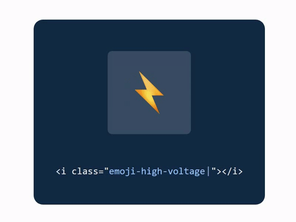
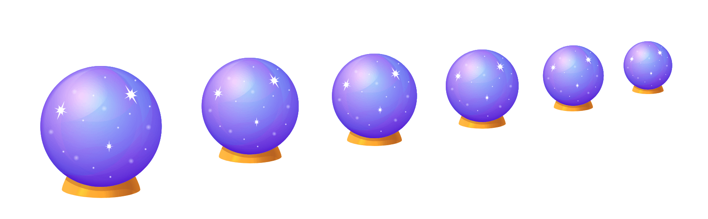

# Emoji cloud
[](https://youtu.be/AcEZ_bgRhpI)

Emoji cloud is a super lightweight CDN for vector emojis. It's the easiest way to add scalable emojis to your projects.

## Table of contents

- [Features](#features)
- [Installation](#installation)

## Features



📏 All emojis are vector SVG's <br />
⚡️ Super Lightweight - under 50kb <br />
🔥 Blazing fast - delivered through [jsdelivr](https://www.jsdelivr.com/) <br />
😎 Easy to use - zero to hero in seconds <br />
💸 Free and open-sourced <br />

## Installation
### 🌐 Include via CDN
1. Add the following code right before the closing ```</head>``` tag
```html
<link rel="stylesheet" href="https://cdn.jsdelivr.net/gh/alohe/emojicloud/emojicloud.css" />
```
2. That's it, you can now start using SVG emojis on your web page


#

Feel free to reach out to me [on Twitter](https://twitter.com/alemalohe) if you have any questions or feedback! 
